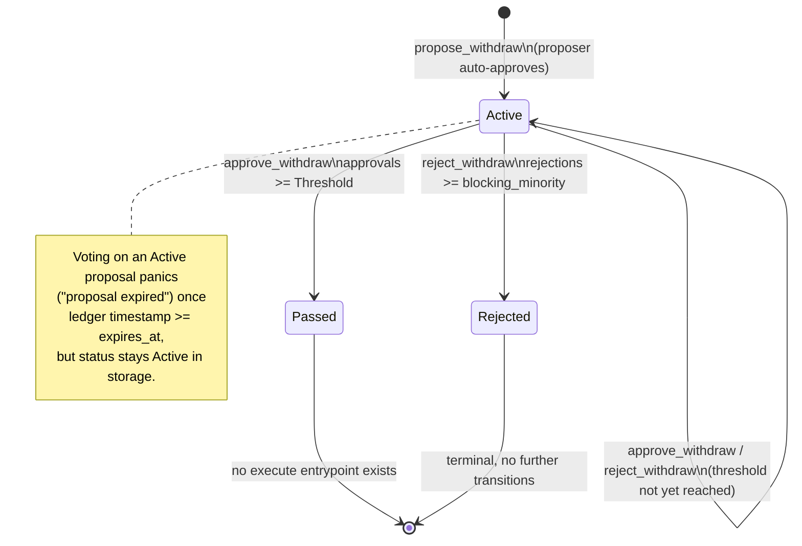

# `group_treasury` Storage Layout

Source: [`contracts/contracts/group_treasury/src/storage.rs`](../contracts/group_treasury/src/storage.rs),
[`contracts/contracts/group_treasury/src/lib.rs`](../contracts/group_treasury/src/lib.rs),
[`contracts/contracts/group_treasury/src/token_interface.rs`](../contracts/group_treasury/src/token_interface.rs).

For the authorization semantics built on top of this storage (membership, threshold, voting),
see [`concepts-treasury-multisig-model.md`](concepts-treasury-multisig-model.md). For the
related `proposals` contract that calls into this one, see
[`api-proposals.md`](api-proposals.md).

## Storage tier: everything is instance storage

Every read/write in `group_treasury` goes through `env.storage().instance()`. The contract
never calls `.persistent()`, `.temporary()`, `.extend_ttl()`, or `bump()` anywhere in
`lib.rs` or `storage.rs`. (`persistent()` calls do appear in the test suite, but only inside
`test.rs`'s in-file mock token contract — an unrelated test fixture, not part of
`group_treasury` itself.)

**Practical effect:** all state — admin, members, balances, proposals, votes — shares the
single instance-storage TTL that Soroban maintains for the contract's instance entry as a
whole. There is no per-key TTL management in this contract: nothing here explicitly bumps or
extends the TTL of any individual entry, and there is no TTL constant defined in the source.
Whether the instance entry itself is kept alive (via the account/operator maintaining rent, a
platform-level restore, or another contract's invocation) is a Soroban platform concern
external to this contract's code — `group_treasury` does not implement any TTL or restoration
logic of its own. If the instance entry expires, every key documented below expires with it;
this contract has no expired-entry recreation logic beyond normal `initialize()` (which itself
panics if `DataKey::Admin` is already set, so it cannot be used to "revive" prior state).

## `DataKey` — storage key inventory

```rust
pub enum DataKey {
    Admin,
    Balances,
    Members,
    Threshold,
    ProposalCount,
    Proposal(u32),
    Vote(u32, Address),
}
```

| Key | Value type | Tier | Meaning | Owner/domain | Lifecycle |
|---|---|---|---|---|---|
| `DataKey::Admin` | `Address` | instance | The address with admin rights (`add_member`, `remove_member`, `withdraw`). | Access control | Set once in `initialize`; never updated after. Read by `require_admin` on every admin-gated call. |
| `DataKey::Balances` | `Map<Address, i128>` | instance | Per-token balances held by the treasury, keyed by token contract address. | Funds accounting | Initialized empty in `initialize`. Updated by `deposit` (increment) and `withdraw` (decrement). Read by `balance`, `propose_withdraw` (funds check). |
| `DataKey::Members` | `Vec<Address>` | instance | The current membership list. | Membership | Initialized empty in `initialize`. Mutated by `add_member` (append, rejects duplicates) and `remove_member` (rebuilds the vector without the removed address). Read by `is_member`, `get_members`, and every voting/proposal function that checks membership. |
| `DataKey::Threshold` | `u32` | instance | Number of approvals required for a proposal to pass. | Multisig config | Set once in `initialize` (must be `>= 1`, enforced by panic). **No function updates it after initialization** — there is no `set_threshold` in `lib.rs`. Read by `get_threshold`, `approve_withdraw`, `reject_withdraw` (blocking-minority calculation). |
| `DataKey::ProposalCount` | `u32` | instance | Total number of proposals ever created; doubles as the next proposal id. | Proposal accounting | Initialized to `0` in `initialize`. Incremented by `propose_withdraw` before assigning the new proposal's id (so ids are `0`-based and monotonically increasing). Read by `list_proposals` and `get_pending_proposals` to bound their scan range. |
| `DataKey::Proposal(u32)` | `WithdrawProposal` | instance | The full record for withdraw proposal `id`. | Proposal state | Created by `propose_withdraw`. Updated in place by `approve_withdraw` and `reject_withdraw` (approval/rejection counters and `status`). Read by `get_proposal`, `list_proposals`, `get_pending_proposals`, and the `require_votable` helper used by both voting functions. |
| `DataKey::Vote(u32, Address)` | `bool` | instance | Whether `Address` voted to approve (`true`) or reject (`false`) proposal `id`. | Vote record | Written once by `approve_withdraw` or `reject_withdraw` the first time an address votes on a given proposal. `require_votable` checks `has(&DataKey::Vote(id, voter))` to reject a second vote from the same address — there is no function that clears or changes an existing vote record. |

`token_interface.rs` defines no storage of its own — it declares the minimal SEP-41
`TokenInterface` trait (`transfer`, `balance`) and the generated `TokenClient` used by
`deposit` and `withdraw` to call the external token contract. It is a cross-contract call
helper, not a storage module.

## Events (not storage, but part of the same source files)

`storage.rs` also defines the event payload types published via `env.events().publish(...)`:
`DepositEvent`, `WithdrawEvent`, `MemberAddedEvent`, `MemberRemovedEvent`,
`WithdrawVoteCastEvent`, `ProposalApprovedEvent`, `ProposalRejectedEvent`,
`ProposalCreatedEvent`. These are emitted, not stored — see
[`contracts-events.md`](contracts-events.md) for the general event catalog.

## `WithdrawProposal`

```rust
pub struct WithdrawProposal {
    pub id: u32,
    pub proposer: Address,
    pub to: Address,
    pub token: Address,
    pub amount: i128,
    pub approvals: u32,
    pub rejections: u32,
    pub status: ProposalStatus,
    pub expires_at: u64,
}
```

| Field | Type | Meaning | Set by | How it changes | Participates in auth/state checks? |
|---|---|---|---|---|---|
| `id` | `u32` | Proposal identifier, equal to the pre-increment value of `ProposalCount`. | `propose_withdraw` | Immutable after creation. | Used as the `DataKey::Proposal`/`DataKey::Vote` key. |
| `proposer` | `Address` | Member who created the proposal. | `propose_withdraw`, from the authenticated `proposer` argument. | Immutable. | Auto-recorded as the first approval vote (see below); not otherwise checked against later calls. |
| `to` | `Address` | Withdrawal recipient. | `propose_withdraw`. | Immutable. | No — informational only within this contract (no execute path reads it yet; see Security section). |
| `token` | `Address` | Token contract address to withdraw from. | `propose_withdraw`. | Immutable. | Used against `DataKey::Balances` when the proposal is created (funds check), not re-checked later. |
| `amount` | `i128` | Amount requested. | `propose_withdraw`, must be `> 0`. | Immutable. | Checked against the treasury's current balance for `token` at proposal-creation time only. |
| `approvals` | `u32` | Running count of approval votes, starting at `1`. | `propose_withdraw` (initializes to `1`), incremented by `approve_withdraw`. | Monotonically increasing. | Compared against `Threshold` after each `approve_withdraw` call to decide the `Passed` transition. |
| `rejections` | `u32` | Running count of rejection votes, starting at `0`. | `propose_withdraw` (initializes to `0`), incremented by `reject_withdraw`. | Monotonically increasing. | Compared against the blocking-minority value after each `reject_withdraw` call to decide the `Rejected` transition. |
| `status` | `ProposalStatus` | Current lifecycle state. | `propose_withdraw` sets `Active`. | Flipped to `Passed` or `Rejected` by the voting functions once their respective thresholds are met; never flipped by any other function. | Gates voting (`require_votable` requires `Active`) and read by `get_pending_proposals` (filters on `Active`). |
| `expires_at` | `u64` | Ledger timestamp after which the proposal can no longer be voted on. | `propose_withdraw`, computed as `env.ledger().timestamp() + (ttl_ledgers as u64 * 5)` — an approximate 5-seconds-per-ledger conversion from the caller-supplied `ttl_ledgers`. | Immutable after creation. | Checked in `require_votable`: a vote panics with `"proposal expired"` once `env.ledger().timestamp() >= expires_at`, even if `status` is still `Active`. |

**Proposer auto-approval:** `propose_withdraw` initializes `approvals: 1` and writes
`DataKey::Vote(id, proposer)` to `true` at creation time — the proposer's own approval counts
immediately, before any other member votes.

### `ProposalStatus`

```rust
pub enum ProposalStatus {
    Active,
    Passed,
    Rejected,
    Executed,
    Expired,
}
```

| Status | Set by | Meaning |
|---|---|---|
| `Active` | `propose_withdraw` | Open for voting. |
| `Passed` | `approve_withdraw`, once `approvals >= Threshold` | Approval threshold reached. |
| `Rejected` | `reject_withdraw`, once `rejections >= blocking_minority` | Enough rejections that `Threshold` approvals can no longer be reached (see the multisig model doc for the exact formula). |
| `Executed` | **No function in `lib.rs` sets this today.** | Defined in the enum for a future execution step; not reachable through any current `group_treasury` entrypoint. |
| `Expired` | **No function in `lib.rs` sets this today.** | Defined in the enum; expiry is currently enforced only as a *guard* inside `require_votable` (a vote after `expires_at` panics with `"proposal expired"`), not as a stored status transition. A proposal whose deadline has passed still reads back as `Active` from `get_proposal`/`list_proposals` until/unless a future finalizer writes `Expired`. |

`src/test.rs` documents this gap directly: its `multisig_flow` test module contains passing
tests for the `Active → Passed` and `Active → Rejected` transitions and for the expiry
*guard*, plus explicitly `#[ignore]`d stub tests — `multisig_execute_on_approved`,
`multisig_execute_on_pending_panics`, and `multisig_finalize_expired` — each annotated
`"blocked: ... not yet implemented (no issue identified)"`. Do not treat `Executed` or a
stored `Expired` transition as implemented behavior.

### Proposal state diagram (as implemented)



No transition reaches `Executed` or a stored `Expired` state in the current implementation.
Funds only move via the separate, admin-gated `withdraw` function (see below) — approving a
`group_treasury`-internal proposal to `Passed` does not itself transfer funds.

| Transition | Triggering function | Required authorization | Approval requirement | Resulting status | Funds move? |
|---|---|---|---|---|---|
| (none) → `Active` | `propose_withdraw` | `proposer.require_auth()`; proposer must be a current member | n/a | `Active` | No |
| `Active` → `Active` | `approve_withdraw` / `reject_withdraw` | Voter `require_auth()`; must be a current member; must not have voted before; proposal must not be expired | Count below the relevant threshold | `Active` (unchanged) | No |
| `Active` → `Passed` | `approve_withdraw` | Same as above | `approvals >= Threshold` | `Passed` | No — `group_treasury` has no function that reads a `Passed` proposal and executes it |
| `Active` → `Rejected` | `reject_withdraw` | Same as above | `rejections >= member_count - Threshold + 1` (saturating) | `Rejected` | No |

## Relationship to `withdraw` and the `proposals` contract

`group_treasury` also exposes a separate, simpler `withdraw(to, token, amount)` function that
is **admin-gated only** (`require_admin`) and moves funds immediately — it does not consult
`DataKey::Proposal` or `DataKey::Vote` at all. This is the function the external `proposals`
contract calls (via `TokenInterface`'s sibling trait in `proposals/src/treasury_interface.rs`,
using `is_member`, `balance`, and `withdraw`) once *its own* independent proposal/vote/finalize
cycle passes. `group_treasury`'s own `propose_withdraw` / `approve_withdraw` / `reject_withdraw`
voting system is a separate, currently execution-less code path within the same contract — the
two are not wired together. See
[`concepts-treasury-multisig-model.md`](concepts-treasury-multisig-model.md) for the full
authorization picture and [`api-proposals.md`](api-proposals.md) for the `proposals` contract's
cross-contract call flow.
